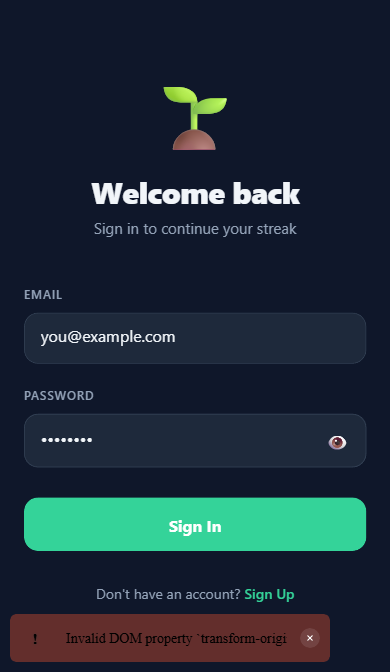
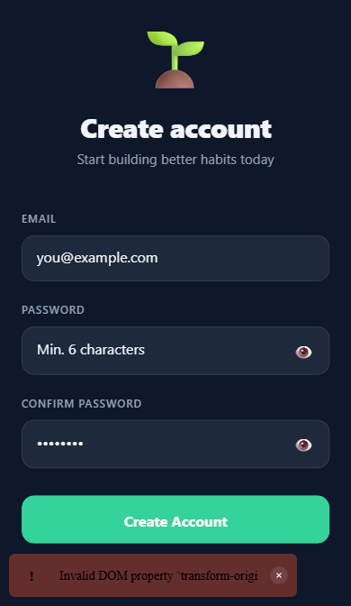
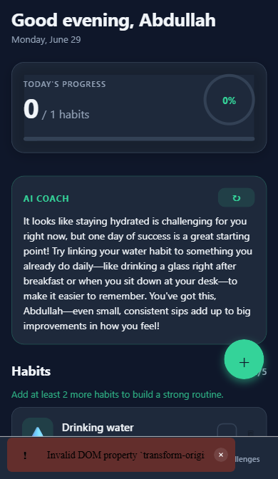
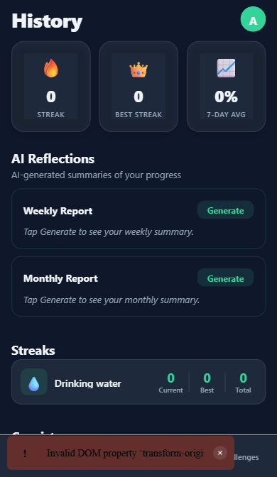
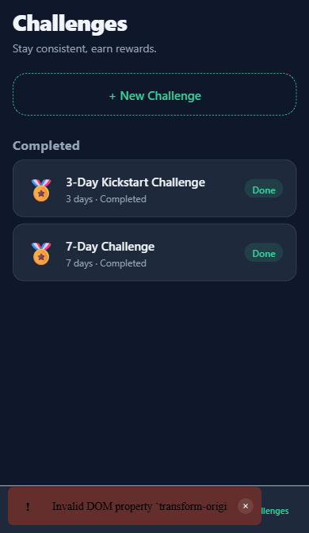
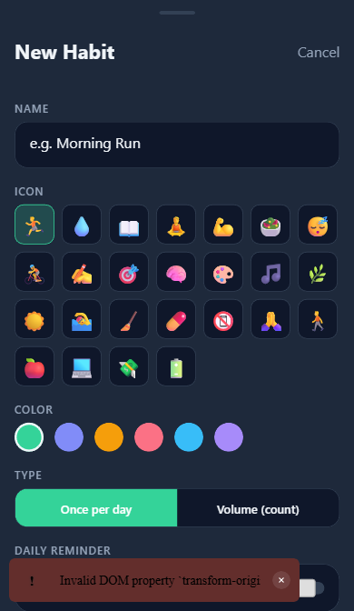

# HabitTrackerApp

A mobile-first habit tracking app built with Expo SDK 56 and React Native. Track daily habits, build streaks, complete challenges, and get personalized AI coaching — all backed by Supabase with real-time cloud sync.

## Screenshots

| Sign In | Sign Up | Today |
|:---:|:---:|:---:|
|  |  |  |

| History | Challenges | Add Habit |
|:---:|:---:|:---:|
|  |  |  |

## Features

- **Create habits** — choose an icon, color, and set a daily or volume-based target
- **Track daily** — log habits with a tap; volume habits count up to their target
- **Streaks & history** — current and best streaks, weekly consistency grid
- **Challenges** — complete a 3-day kickstart challenge at onboarding; create custom challenges
- **AI coaching** — personalized nudges, weekly and monthly summaries powered by Claude Haiku via OpenRouter
- **Reminders** — per-habit push notifications at user-specified times
- **Celebration animations** — particle burst and sound effects on habit completion
- **Cloud sync** — all data synced to Supabase; local-first with optimistic updates

## Tech stack

| Layer | Library |
|---|---|
| Framework | Expo SDK 56 / React Native 0.85.3 |
| Navigation | Expo Router v3 (file-based) |
| State | Zustand v5 (persisted via AsyncStorage) |
| Backend | Supabase (PostgreSQL + Auth + Edge Functions) |
| AI | Claude Haiku 4.5 via OpenRouter (Supabase Edge Function) |
| Animations | React Native Reanimated 4 |
| Audio | expo-audio |
| Notifications | expo-notifications |

## Getting started

### 1. Clone and install

```bash
npm install
```

### 2. Configure environment

Copy `.env.example` to `.env` and fill in your Supabase project values:

```bash
cp .env.example .env
```

```
EXPO_PUBLIC_SUPABASE_URL=https://your-project-id.supabase.co
EXPO_PUBLIC_SUPABASE_ANON_KEY=your-anon-key-here
```

### 3. Set up the database

Run `supabase/schema.sql` in the Supabase SQL Editor (Dashboard → SQL Editor → New query). This creates all tables, RLS policies, and the auto-profile trigger.

### 4. Configure AI coaching (optional)

The AI coaching feature requires an OpenRouter API key stored as a Supabase Edge Function secret:

```
Dashboard → Edge Functions → Manage secrets → Add OPENROUTER_API_KEY
```

Deploy the Edge Function:

```bash
supabase functions deploy ai-insights
```

### 5. Run the app

```bash
npm start        # Expo Go (notifications/audio disabled in Go)
npm run android  # Android emulator or device
npm run ios      # iOS simulator or device
npm run web      # Browser (http://localhost:8081)
```

> Push notifications and audio require a development build — they do not work in Expo Go.

## Project structure

```
app/                    # Expo Router screens
  _layout.tsx           # Root stack + Supabase auth listener
  index.tsx             # Entry redirect (auth → onboarding → tabs)
  onboarding.tsx        # 5-step onboarding flow
  habit-modal.tsx       # Add/edit habit bottom sheet
  auth/
    index.tsx           # Sign in
    sign-up.tsx         # Sign up
    forgot-password.tsx # Password reset request
  (tabs)/               # Main tab navigator
    index.tsx           # Today — daily habit logging
    history.tsx         # Streaks, consistency chart, AI reflections
    challenges.tsx      # Challenge tracking and rewards

src/
  store.ts              # Zustand store — all state, actions, selectors
  sync.ts               # Supabase push/pull helpers (local-first)
  ai.ts                 # AI insight stat computation + Edge Function call
  supabase.ts           # Supabase JS client
  types.ts              # Shared TypeScript types
  theme.ts              # Colors, spacing, and radius tokens
  notifications.ts      # Push notification scheduling
  sound.ts              # Web audio no-op
  sound.native.ts       # Native audio (expo-audio)

supabase/
  schema.sql            # Full database schema with RLS policies
  functions/
    ai-insights/        # Deno Edge Function — calls OpenRouter, saves to DB
```

## Architecture highlights

- **Local-first sync** — every mutation updates Zustand immediately (optimistic), then fire-and-forgets a background push to Supabase. Users never wait for the network.
- **RLS everywhere** — all 5 Supabase tables have Row Level Security with `WITH CHECK` clauses. No data is ever readable or writable by another user.
- **Auth gating** — `isHydrating` prevents premature routing on cold start. The root index waits for `onAuthStateChange` to fire before redirecting.
- **FK-safe onboarding** — `completeOnboarding` chains `pushProfile → pushHabit + pushChallenge` (never concurrent) to satisfy the `profiles` FK constraint.
- **AI on the server** — the OpenRouter API key and Supabase service role key never leave the Edge Function. The client sends only habit stats (no raw logs).
